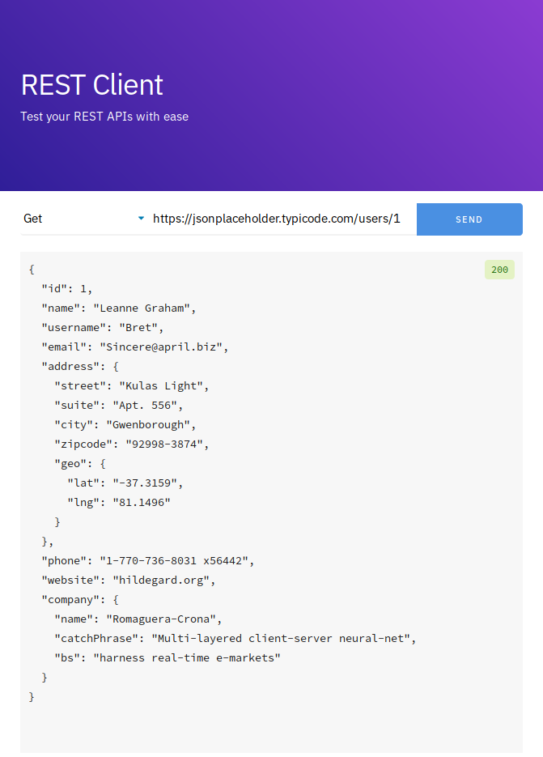
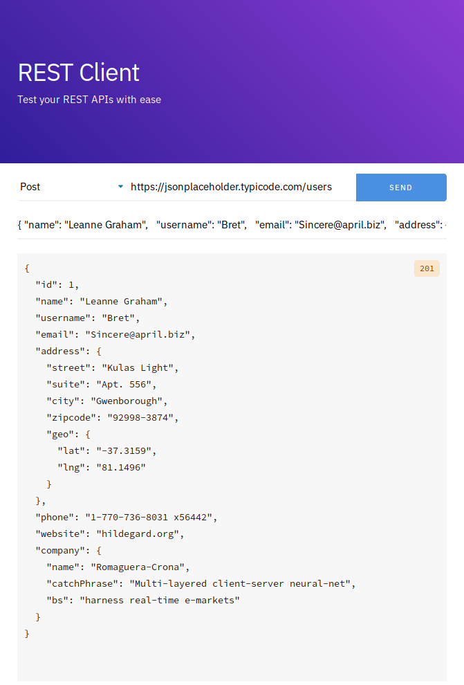

# REST Client
A simple Javascript Application for testing REST APIs

## Screenshots



## Usage
Clone this Repository and Open the terminal in the project directory. Then execute the following commands

```bash
$ npm install
$ npm run start
```

The Node Server can also be started in development mode using the following command

```bash
$ npm run dev
```

## Approach
This application has been developed with just the very basic set of features. When I see that more features are needed, they can be added incrementally.

## Design
All User Requests are submitted to the backend Node / Express server which then forwards this request to the requested API URL. The response is then sent back to the client browser.

This design was implemented to prevent Cross-Origin Resource Sharing (CORS) policy related issues in client browsers.